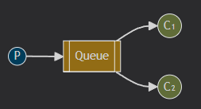
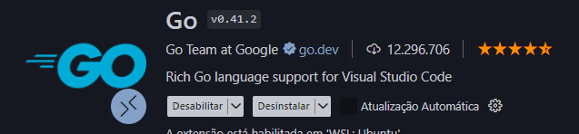
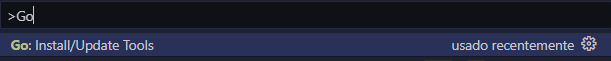

# Arquitetura utilizada
Work Queues

 
 
 

# Recursos necessários para testes
- docker
- golang 19
- extensão go vscode

- instalar/atualizar tools go 
  - ctrl+shift+p -> go: install/update tools
    
    

 
 
 

# Links úteis
- https://www.enterpriseintegrationpatterns.com/patterns/messaging/CompetingConsumers.html

- https://www.rabbitmq.com/tutorials/tutorial-two-go

- https://www.rabbitmq.com/tutorials

- https://www.rabbitmq.com/docs
